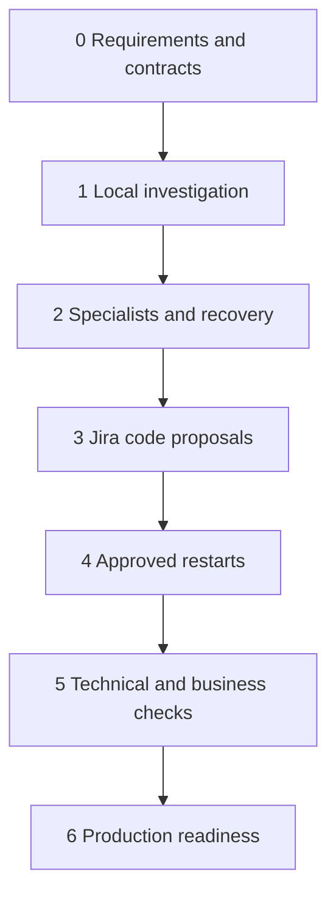

# AgenticaWithAkka Roadmap

Last reviewed: 9 October 2026

## Current position

Requirements v0.7 and the phased design are documented. Phase 0 is **In progress** because approval of open decisions, contracts and technology selection remains outstanding. Phase 1 is **In progress** with a tested backend scaffold, verified Spring AI/Akka compatibility probes, versioned domain contracts/ports, a policy-gated read-only tool registry, OIDC/JWT identity mapping and a process-local deterministic investigation API over synthetic sources. The local workflow has no model calls, durable recovery, multi-instance state or browser UI; real-source OBO remains open. Phases 2–6 are **Planned**. The scaffold does not establish lab completion or production readiness. Owners and dates remain unassigned; no delivery estimates are committed.

Sources: [production requirements](requirements/agenticawithakka-production-requirements.md) and [agentic design](design/agentic-design-and-phased-plan.md).

## Phase overview

| Phase | Goal | Status | Dependency |
| --- | --- | --- | --- |
| 0 | Requirements and contracts | In progress | None |
| 1 | Read only local lab | In progress | Phase 0 |
| 2 | Specialists and recovery | Planned | Phase 1 |
| 3 | Jira and code proposals | Planned | Phase 2 |
| 4 | Safe operational actions | Planned | Phase 3 |
| 5 | Verification and business gates | Planned | Phase 4 |
| 6 | Integrations and production readiness | Planned | Phase 5 |

## Phase 0 Requirements and contracts

Status: In progress

Goal: Agree the scope and execution boundaries.

Depends on: None. Independent connector proofs may run earlier without bypassing exit gates.

Deliverables:

- [x] Document production requirements v0.7 and proposed phased design.
- [x] Draft the [technical design](design/technical-design.md), with unconfirmed choices marked proposed.
- [x] Perform [documentation consistency review](reviews/documentation-review.md) and correct identified wording gaps.
- [ ] Approve requirements and open decisions
- [ ] Define role and source/OBO capability matrices
- [ ] Define message, tool and verification contracts
- [ ] Select compatible components and review licenses
- [ ] Confirm AKS target, approved base images, registry, access routes and stateful hosting decisions

Exit criteria: Initial scenarios have agreed inputs, expected outcomes and tests; unsupported source delegation is explicit.

Open decisions: first real sources, runtime and licensing, identity strategy, business approvers, polling windows and operational targets.

## Phase 1 Read only local lab

Implementation guide: [Phase 1 instructions](implementation/phase-1-instructions.md). Scaffold evidence: [Windows backend guide](implementation/backend-scaffold.md) and [dependency decision](decisions/0001-backend-scaffold.md).

Status: In progress

Goal: Start with Coordinator and combined Investigation agents.

Depends on: Phase 0. Independent connector proofs may run earlier without bypassing exit gates.

Deliverables:

- [x] P1-02 backend scaffold: Maven Wrapper, package boundaries, configuration validation and local health endpoint; JDK 25 build, 9 tests and packaged-JAR HTTP check passed, including a fresh source-only copy.
- [x] P1-01 partial evidence: resolve Spring AI 2.0.1 and pass an isolated Boot 4.0.8 / Temurin 25 Ollama HTTP-fixture integration test; [results and limits](decisions/0002-integration-probes.md).
- [x] P1-01 partial evidence: isolated Akka Typed 2.10.23 request/reply and shutdown test passed on Temurin 25 from locally cached artifacts, including a user-run full hardened script with the repository profile active (fresh resolution and combined test are recorded below); [results and limits](decisions/0002-integration-probes.md).
- [x] P1-01 partial evidence: combined Spring AI 2.0.1 + Akka Typed 2.10.23 probe passed on Temurin 25 in one Boot 4.0.8 context (actor delegates a ChatClient call to a bounded executor; loopback model fixture); [results and limits](decisions/0002-integration-probes.md).
- [x] P1-01 partial evidence: fresh Akka 2.10.23 resolution from the authorized `akka-repository` into an empty isolated Maven cache, with the combined probe passing on Temurin 25 (user-run, 8 October 2026); [results and limits](decisions/0002-integration-probes.md).
- [x] P1-04 local adapter slice: opaque expiring/revocable identity contexts, deny-first project/resource/source policy, and HMAC-bound mock delegated credentials with independent source ACL checks; 8 new tests pass (122 total); [decision and limits](decisions/0005-identity-policy-mock-connectors.md).
- [x] P1-04 OIDC/JWT and local authorization revalidation: Spring Security verifies signature, issuer, audience and expiry; `(iss, sub)` maps to server-configured grants. Tool/source access, resume and stored-result gates recheck current membership and citations; revocation tests included; full suite passes (137 tests); [decision and evidence](decisions/0006-oidc-jwt-authentication.md).
- [ ] Finish P1-04 source integration: real-source OBO, consent and revocation are not implemented; mock adapters are not vendor token exchange.
- [x] P1-05 versioned task/tool/evidence contracts and Phase 1 ports (AgentRuntime, ModelGateway, SearchGateway, SourceConnector, DelegatedTokenProvider, PolicyDecisionService); 50 new validation/serialization/boundary tests pass (59 total); approval/verification contracts deferred; [decision](decisions/0003-domain-contracts-and-ports.md).
- [x] P1-06 tool part: read-only tool registry exposing only searchKnowledge, queryMockLogs and inspectMockHealth. Discovery and invocation are gated by role, argument schema and policy (tool and resource arguments), with deadline/timeout, bounded retries and per-source evidence re-authorization before release. Verified with test fakes: 55 new tests pass (114 total); [decision](decisions/0004-tool-registry-and-permissions.md).
- [ ] P1-06 skill registry (SKL-01..03) and production policy/identity/search adapters; process-local wiring to the mock adapters is implemented under P1-08; see [decision 0007](decisions/0007-process-local-investigation-workflow.md).
- [ ] Finish P1-01 with the deferred Akka production-license decision (current policy: dev/non-production only; key injected from a secret store); artifact availability is not runtime compatibility.
- [ ] Complete P1-11 full lab setup/demo documentation; only backend build and smoke commands are verified.
- [ ] Build separate UI/API container images from approved base images
- [ ] Build browser login, project selection, investigation, progress/results and cancellation screens
- [ ] Test browser reconnect, safe rendering and primary keyboard navigation
- [ ] Seed synthetic runbooks and mock logs
- [x] Implement bounded local Coordinator and Investigation roles using registered read tools; deterministic synthetic workflow only, no model or Akka runtime; tested in `ProcessLocalInvestigationServiceTest`.
- [x] Return execution IDs and provide same-process authorized status/result reconnect, cancellation and same-subject authentication resume; HTTP bearer flow tested in `OidcResourceServerIntegrationTest`.
- [x] Test cumulative step exhaustion, authentication expiry/resume, cancellation before and during a read, cross-project access and membership revocation during execution and after completion; focused suite passes (35 tests); see [decision 0007](decisions/0007-process-local-investigation-workflow.md).
- [x] Enforce project/user authorization at create, status, cancel, resume, each tool call and evidence retrieval; supported by OIDC integration and authorization-revalidation tests.
- [x] Return reauthorized evidence citations; prompt-injection resistance remains untested.
- [ ] Add redacted execution tracing and verify trace redaction.

Exit criteria: An authorized investigation succeeds; cross-project access is denied and runaway tasks terminate.

Open checks: complete deliverables and retain test or review evidence before advancing.

## Phase 2 Specialists and recovery

Status: Planned

Goal: Separate Knowledge and Observability; retain Coordinator.

Depends on: Phase 1. Independent connector proofs may run earlier without bypassing exit gates.

Deliverables:

- [ ] Implement typed task and result communication
- [ ] Add deadlines, cancellation and duplicate handling
- [ ] Persist investigation state and resume safely
- [ ] Persist background admission, checkpoints, waits and scheduled wake-ups
- [ ] Test ownership fencing, duplicate recovery, bounded queues and budgets across resumes
- [ ] Add traces and initial admin timeline

Exit criteria: Parallel evidence combines correctly; restart resumes work and specialist failures produce explicit partial results.

Open checks: complete deliverables and retain test or review evidence before advancing.

## Phase 3 Jira and code proposals

Status: Planned

Goal: Add Change Analysis as the fourth role.

Depends on: Phase 2. Independent connector proofs may run earlier without bypassing exit gates.

Deliverables:

- [ ] Read mock Jira tickets and versioned repository context
- [ ] Generate reviewable patches with rationale
- [ ] Run tests in a restricted environment and report actual results
- [ ] Verify stale patch handling and optional authorized draft PR flow

Exit criteria: Each patch is tied to a ticket and base commit; unsafe execution and unauthorized writes are blocked.

Open checks: complete deliverables and retain test or review evidence before advancing.

## Phase 4 Safe operational actions

Status: Planned

Goal: Add Operations as the fifth role.

Depends on: Phase 3. Independent connector proofs may run earlier without bypassing exit gates.

Deliverables:

- [ ] Create disposable local workloads
- [ ] Build exact-target browser approval and restart execution
- [ ] Enforce safety checks, expiry, cooldown and access revalidation
- [ ] Record readiness and reconcile uncertain outcomes

Exit criteria: Approved restart succeeds; stale targets, revocation and duplicate requests cannot trigger unsafe actions.

Open checks: complete deliverables and retain test or review evidence before advancing.

## Phase 5 Verification and business gates

Status: Planned

Goal: Add Verification as the sixth role.

Depends on: Phase 4. Independent connector proofs may run earlier without bypassing exit gates.

Deliverables:

- [ ] Create runbook-based verification plans
- [ ] Poll logs, metrics and health against deployed versions
- [ ] Record technical pass, fail or inconclusive outcomes
- [ ] Provide browser business-validation screens and require manual acceptance for functionality changes
- [ ] Enforce closure gates and complete the admin eagle view

Exit criteria: Startup alone cannot prove a fix; business changes remain open until required human acceptance.

Open checks: complete deliverables and retain test or review evidence before advancing.

## Phase 6 Integrations and production readiness

Status: Planned

Goal: Prove the same six roles against real sources.

Depends on: Phase 5. Independent connector proofs may run earlier without bypassing exit gates.

Deliverables:

- [ ] Implement and validate WhatsApp, Telegram and SMS channel adapters, linked identities and safe browser handoff
- [ ] Test webhook deduplication, notification failures and channel data restrictions
- [ ] Test actual delegated authentication, consent and revocation
- [ ] Validate ingestion permissions and freshness
- [ ] Run capacity, security and model-quality evaluations
- [ ] Validate AKS manifests, probes, resource limits, private services and approved external webhook routes
- [ ] Test backup restoration, release and rollback
- [ ] Obtain operational acceptance against agreed production gates

Exit criteria: Production acceptance scenarios pass under agreed load and source policies; required owners accept the evidence.

Open checks: complete deliverables and retain test or review evidence before advancing.

## Updating progress

Use the `project-roadmap` skill to maintain this file from current requirements, design and verified work. Check off a task only when evidence supports completion; mark a phase Complete only after all mandatory exit criteria pass. Link real issues, PRs, tests and review records as they become available. No implementation issues or milestones have been created by this roadmap update.

Business acceptance remains a human decision. Admin visibility respects source permissions. Protected execution and rollback require authorization. Missing or inconclusive evidence keeps validation open.

## Background work scope

See requirements BKG-01 through BKG-09. Phase 1 provides browser-independent tasks while the process is running; Phase 2 adds crash-safe continuation before operational writes. No recurring unattended task is authorized by this roadmap. The documentation review predates the v0.4 background-work additions; those changes require follow-up implementation acceptance evidence.

## Messaging channel delivery

Requirements CHN-01 through CHN-08 cover WhatsApp, Telegram and SMS. Design/mock adapter work may begin after core background contracts are stable; real-channel acceptance is part of Phase 6. Require durable request admission from Phase 2, same-user source authorization and a separately agreed provider/conversation policy. Protected approvals and business acceptance use authenticated browser handoff by default.
