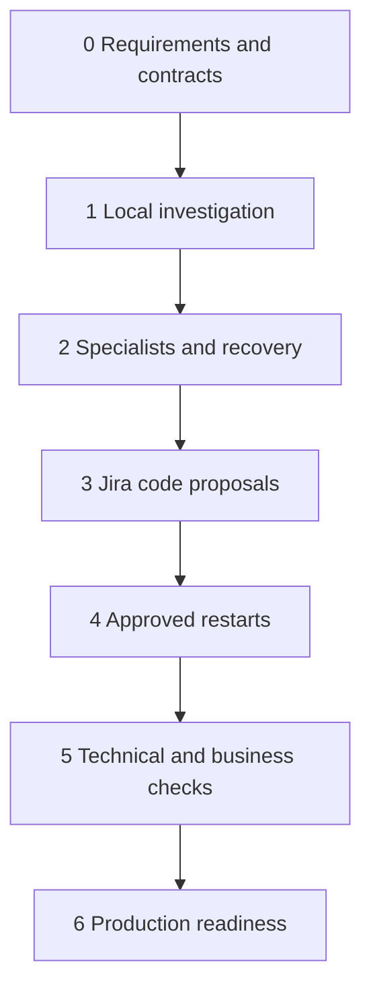

# AgenticaWithAkka Roadmap

Last reviewed: 7 October 2026

## Current position

Requirements v0.3 and the phased design are documented. Phase 0 is **In progress** because approval of open decisions, contracts and technology selection remains outstanding. Phases 1–6 are **Planned**. Documentation does not establish implementation or production readiness. Owners and dates remain unassigned; no delivery estimates are committed.

Sources: [production requirements](requirements/agenticawithakka-production-requirements.md) and [agentic design](design/agentic-design-and-phased-plan.md).

## Phase overview

| Phase | Goal | Status | Dependency |
| --- | --- | --- | --- |
| 0 | Requirements and contracts | In progress | None |
| 1 | Read only local lab | Planned | Phase 0 |
| 2 | Specialists and recovery | Planned | Phase 1 |
| 3 | Jira and code proposals | Planned | Phase 2 |
| 4 | Safe operational actions | Planned | Phase 3 |
| 5 | Verification and business gates | Planned | Phase 4 |
| 6 | Integrations and production readiness | Planned | Phase 5 |

## Phase 0 Requirements and contracts

Status: In progress

Goal: Agree the scope and execution boundaries.

Depends on: None. Independent connector proofs may run earlier without bypassing exit gates.

Deliverables:

- [x] Document production requirements v0.3 and proposed phased design.
- [x] Draft the [technical design](design/technical-design.md), with unconfirmed choices marked proposed.
- [x] Perform [documentation consistency review](reviews/documentation-review.md) and correct identified wording gaps.
- [ ] Approve requirements and open decisions
- [ ] Define role and source/OBO capability matrices
- [ ] Define message, tool and verification contracts
- [ ] Select compatible components and review licenses

Exit criteria: Initial scenarios have agreed inputs, expected outcomes and tests; unsupported source delegation is explicit.

Open decisions: first real sources, runtime and licensing, identity strategy, business approvers, polling windows and operational targets.

## Phase 1 Read only local lab

Implementation guide: [Phase 1 instructions](implementation/phase-1-instructions.md). This is a documentation artifact; runtime deliverables below remain unchecked.

Status: Planned

Goal: Start with Coordinator and combined Investigation agents.

Depends on: Phase 0. Independent connector proofs may run earlier without bypassing exit gates.

Deliverables:

- [ ] Seed synthetic runbooks and mock logs
- [ ] Implement two agents with bounded execution
- [ ] Add project and user authorization
- [ ] Return cited evidence and test prompt-injection resistance

Exit criteria: An authorized investigation succeeds; cross-project access is denied and runaway tasks terminate.

Open checks: complete deliverables and retain test or review evidence before advancing.

## Phase 2 Specialists and recovery

Status: Planned

Goal: Separate Knowledge and Observability; retain Coordinator.

Depends on: Phase 1. Independent connector proofs may run earlier without bypassing exit gates.

Deliverables:

- [ ] Implement typed task and result communication
- [ ] Add deadlines, cancellation and duplicate handling
- [ ] Persist investigation state and resume safely
- [ ] Add traces and initial admin timeline

Exit criteria: Parallel evidence combines correctly; restart resumes work and specialist failures produce explicit partial results.

Open checks: complete deliverables and retain test or review evidence before advancing.

## Phase 3 Jira and code proposals

Status: Planned

Goal: Add Change Analysis as the fourth role.

Depends on: Phase 2. Independent connector proofs may run earlier without bypassing exit gates.

Deliverables:

- [ ] Read mock Jira tickets and versioned repository context
- [ ] Generate reviewable patches with rationale
- [ ] Run tests in a restricted environment and report actual results
- [ ] Verify stale patch handling and optional authorized draft PR flow

Exit criteria: Each patch is tied to a ticket and base commit; unsafe execution and unauthorized writes are blocked.

Open checks: complete deliverables and retain test or review evidence before advancing.

## Phase 4 Safe operational actions

Status: Planned

Goal: Add Operations as the fifth role.

Depends on: Phase 3. Independent connector proofs may run earlier without bypassing exit gates.

Deliverables:

- [ ] Create disposable local workloads
- [ ] Build exact-target approval and restart execution
- [ ] Enforce safety checks, expiry, cooldown and access revalidation
- [ ] Record readiness and reconcile uncertain outcomes

Exit criteria: Approved restart succeeds; stale targets, revocation and duplicate requests cannot trigger unsafe actions.

Open checks: complete deliverables and retain test or review evidence before advancing.

## Phase 5 Verification and business gates

Status: Planned

Goal: Add Verification as the sixth role.

Depends on: Phase 4. Independent connector proofs may run earlier without bypassing exit gates.

Deliverables:

- [ ] Create runbook-based verification plans
- [ ] Poll logs, metrics and health against deployed versions
- [ ] Record technical pass, fail or inconclusive outcomes
- [ ] Require manual business acceptance for functionality changes
- [ ] Enforce closure gates and complete the admin eagle view

Exit criteria: Startup alone cannot prove a fix; business changes remain open until required human acceptance.

Open checks: complete deliverables and retain test or review evidence before advancing.

## Phase 6 Integrations and production readiness

Status: Planned

Goal: Prove the same six roles against real sources.

Depends on: Phase 5. Independent connector proofs may run earlier without bypassing exit gates.

Deliverables:

- [ ] Test actual delegated authentication, consent and revocation
- [ ] Validate ingestion permissions and freshness
- [ ] Run capacity, security and model-quality evaluations
- [ ] Test backup restoration, release and rollback
- [ ] Obtain operational acceptance against agreed production gates

Exit criteria: Production acceptance scenarios pass under agreed load and source policies; required owners accept the evidence.

Open checks: complete deliverables and retain test or review evidence before advancing.

## Updating progress

Use the `project-roadmap` skill to maintain this file from current requirements, design and verified work. Check off a task only when evidence supports completion; mark a phase Complete only after all mandatory exit criteria pass. Link real issues, PRs, tests and review records as they become available. No implementation issues or milestones have been created by this roadmap update.

Business acceptance remains a human decision. Admin visibility respects source permissions. Protected execution and rollback require authorization. Missing or inconclusive evidence keeps validation open.
