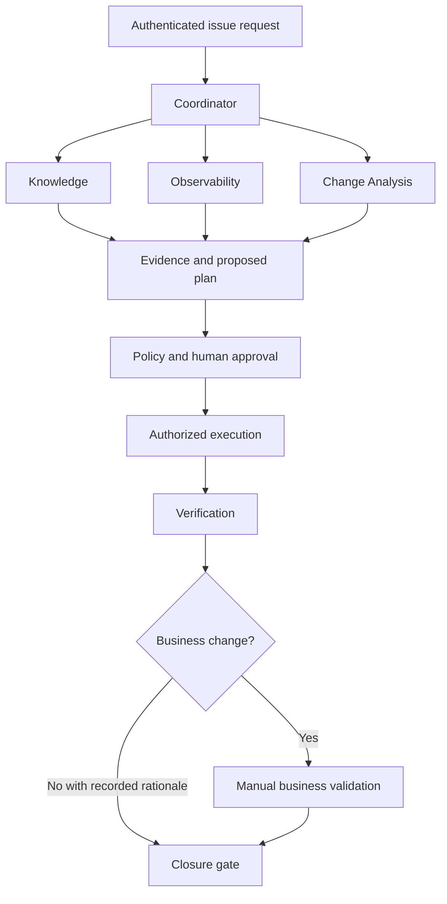

# AgenticaWithAkka Agentic Design and Phased Delivery Plan

Version 0.1 | 7 October 2026 | Proposed design for review

## 1 Purpose and requirements baseline

This document explains how agents, skills, tools and platform services work together, and how to deliver the application in manageable phases. It is based on [production requirements version 0.3](../requirements/agenticawithakka-production-requirements.md), repository blob `97db05215bd6bb2b9e59776d60cb0cf6dbfc23bb` on `feature/agentic`.

The recommendation is six logical AI agent roles at full scope, starting with two in the first working lab. These are responsibility boundaries, not a requirement for six models, processes or deployments. A role may have many concurrent execution instances. Technology selection and exact framework APIs belong in the later technical design.

The earlier seven-role proposal counted the admin issue overview as an agent. The overview is better implemented as a permission-controlled projection of stored evidence and events. An optional summarization agent could be added later, but it is not required to meet the current requirements.

## 2 Agent inventory

| Agent | Purpose and inputs | Skills and tools | Outputs and limits |
| --- | --- | --- | --- |
| Coordinator | Interpret the request, identify its scope, delegate work and combine findings. Inputs include issue ID, request and trusted project/user context. | Investigate issue; delegate task; read execution status; request approval or business review. | Investigation plan, evidence summary, proposed next steps. Cannot override policy, approve its own action or declare business acceptance. |
| Knowledge | Find relevant runbooks, documentation and historical solutions. | Retrieve authorized knowledge; compare source versions; return citations. | Evidence passages, source versions, freshness and gaps. Cannot treat document instructions as system authority. |
| Observability | Investigate current and historical logs, metrics, alerts and dependencies. | Query bounded logs/metrics; inspect health; compare time windows. | Baseline, anomalies, affected services and evidence. Read-only; temporal correlation is not proof of causation. |
| Change Analysis | Relate Jira acceptance criteria to recent code and deployment history; propose a fix. | Read ticket; inspect repository; compare commits; generate patch; request sandbox validation. | Ticket-linked patch, base commit, rationale, risks and actual test status. No implied merge or deployment authority. |
| Operations | Interpret an approved operational plan and coordinate a safe workload restart. | Inspect workload; prepare restart proposal; invoke authorized action executor; inspect readiness. | Exact target, proposed action and outcome. Deterministic executor validates and performs the write; agent cannot bypass it. |
| Verification | Build a verification plan and interpret post-change evidence. | Read runbook/criteria; request bounded polling; evaluate positive signals and regressions; request business review. | Technical passed/failed/inconclusive result and business gate status. A human supplies business acceptance. |

An AI agent can interpret ambiguous evidence or plan work. Predictable operations such as issuing a restart, polling every configured interval, validating tokens or enforcing approval expiry should be ordinary services. Do not invoke a model for every poll or every state transition.

## 3 Platform services rather than agents

| Service | Responsibility |
| --- | --- |
| Identity and connector token service | Authenticate users and obtain source-specific delegated credentials. Keep tokens out of prompts and ordinary messages. |
| Authorization and policy enforcement | Check project, source, resource, operation and current permissions at execution boundaries. Default deny. |
| Skill and tool registry | Publish versioned definitions, schemas, permissions, risk levels and budgets. |
| Workflow state and audit | Persist tasks, evidence, decisions, action receipts and review states; correlate them across agents. |
| Approval service | Bind approval to exact action, target, version, approver, expiry and execution. Recheck it before a write. |
| Connector adapters | Access each source through its approved authentication and capability contract. |
| Ingestion and retrieval | Extract, chunk, embed and retrieve knowledge while preserving provenance and access metadata. |
| Action executor | Perform only validated approved operations; enforce idempotency, cooldowns and reconciliation. |
| Polling scheduler | Run bounded observations with intervals, deadlines, rate limits and recoverable checkpoints. |
| Business review service | Obtain and record a real authorized reviewer's acceptance or rejection. |
| Issue overview projection | Build the admin eagle view from events and evidence, filtered by current access. |

## 4 How work moves between agents

The coordinator chooses relevant specialists; it need not call every agent for every request. Specialists may work in parallel on read-only evidence. Protected actions follow explicit gates. The admin overview reads stored events from every stage rather than asking all agents to regenerate their conclusions.

Every delegated message should contain a schema version, execution and task IDs, correlation ID, project, trusted identity reference, deadline, task input and reply route. Responses should contain status, evidence references, structured findings and failure details. Credentials are resolved by the connector layer, not carried in model text.

If Akka is selected, typed actors are a candidate execution mechanism: a per-investigation coordinator sends typed commands to specialist workers and receives typed results. Adapters translate those results into coordinator messages. Slow model and API calls run asynchronously and return completion messages to the actor. Actor mailboxes serialize state transitions; persistence and idempotency still need explicit design. Ordinary actor messaging must not be assumed to provide durable or exactly-once delivery.

Logical messages and outcomes remain stable if the runtime changes. Distributed deployment is deferred until load or resilience needs justify it. Dependency versions, licensing and exact runtime configuration must be verified during technical design.

## 5 Skills and tool contracts

Example skills are investigate incident, find runbook, correlate recent change, propose Jira fix, restart managed workload and verify deployed change. Each skill has an owner, version, purpose, input/output schemas, permitted tools, policy requirements and budgets.

Example tool contracts include `searchKnowledge`, `queryLogs`, `readTicket`, `readRepository`, `inspectWorkload`, `proposePatch`, `executeApprovedRestart` and `startVerificationPolling`. Names are illustrative rather than selected APIs.

The model requests a tool. The application validates arguments, checks identity and policy, resolves the source credential, executes within a deadline, records the outcome and returns a bounded result. A retrieved runbook cannot grant new tools or change the effective user. A tool denial is returned as a denial, not hidden as an empty successful response.

## 6 Main workflows

### Read only investigation

The coordinator starts an execution; Knowledge retrieves authorized runbooks while Observability gathers logs and health evidence. Change Analysis is invoked if a recent deployment or Jira requirement is relevant. The coordinator reports facts separately from hypotheses, links evidence and identifies missing coverage. No write permission is required to deliver findings.

### Jira linked code change

Change Analysis reads the ticket and exact repository commit, explains the proposed patch and requests restricted validation. Reviewers see the diff, test results and limitations. A branch or draft PR can be created only under its own authorization. Merge and deployment are separate events and permissions. Verification begins after a confirmed deployed version, not when a patch is generated.

### Approved pod restart

Operations identifies the exact cluster, namespace, workload and pod, captures baseline evidence and proposes a specific operation. The approval service records a decision. The executor rechecks user access, resource identity, safety conditions, cooldown and approval expiry. It performs the action, records the source receipt and reconciles ambiguous responses before retrying. Readiness alone is not proof of a functional fix.

### Technical and business verification

Verification derives measurable checks from versioned runbooks, Jira criteria and recent changes. The scheduler polls authorized logs, metrics and health checks after deployment and any required restart. Positive expected signals and regression checks produce passed, failed or inconclusive status.

For a business functionality change, an authorized business reviewer tests the business criteria and explicitly approves or rejects the deployed version. Uncertain business-impact classification requires human review. The closure service requires a technical pass plus business approval or an authorized not-required rationale. Failure, missing evidence or rejection keeps the change open and prompts follow-up. Rollback needs authorization and its own verification.

## 7 Phased implementation

Durations are intentionally not promised. Each phase ends with observable evidence; estimates follow confirmation of developer capacity, source access and hardware.

| Phase | Agent roles active | Deliverables | Exit gate |
| --- | --- | --- | --- |
| 0 Requirements and contracts | No runtime agents | Agree open decisions, role matrix, source/OBO capability matrix, action risk classes, verification rules and evaluation scenarios. Define contracts and select compatible replaceable components. | Every initial scenario has inputs, expected outcomes, owner and test plan; unsupported source delegation is explicit. |
| 1 Read only local lab | Coordinator and combined Investigation | Investigation combines Knowledge and Observability initially. Synthetic runbooks and mock logs, two users, project isolation, basic skill/tool registry, bounded agent loop and citations. | Same question yields only each user's permitted evidence; injected instructions cannot bypass tools; runaway tasks stop. |
| 2 Specialist execution and recovery | Coordinator, Knowledge, Observability | Split Investigation into specialists. Structured communication, asynchronous tasks, deadlines, duplicate handling, persistent execution, traces and initial admin timeline. Introduce Akka here if chosen. | Parallel evidence combines correctly; process restart resumes; unavailable specialist yields explicit partial results; cancellation propagates. |
| 3 Jira and code proposals | Add Change Analysis, total four | Mock Jira and repository first, then one approved real integration. Version-bound patches, sandbox tests and optional authorized draft PR. | Proposal cites ticket and base commit; stale patches and malicious inputs are handled; executed and suggested tests are distinguished. |
| 4 Safe operational actions | Add Operations, total five | Local disposable workload, approval UI, exact-target restart executor, disruption checks, cooldowns, action receipts and readiness observation. | Approval expiry, changed target, revocation and duplicate request block unsafe actions; uncertain outcomes reconcile. |
| 5 Verification and business gates | Add Verification, total six | Runbook-driven plans, deployed-version correlation, bounded log polling, technical result states, business review and closure gates. Complete admin eagle view. | Healthy startup without positive functional evidence cannot pass; technical pass cannot close a business change before human acceptance. |
| 6 Real integrations and production readiness | Same six roles | Prove real OBO, consent and revocation; ingestion permission freshness; capacity, security and quality evaluation; backup/restore, release/rollback and support runbooks. | Production acceptance scenarios pass under agreed load and source policies; operational owners accept the evidence. |

Each phase should deliver a working vertical slice. A local mock identity flow is not evidence that a real vendor supports delegated OBO. Real connectors can be proved incrementally in earlier phases, while Phase 6 closes remaining production gates.

## 8 Work packages and proposed repository organization

| Work package | Main contents | Primary requirements |
| --- | --- | --- |
| Core contracts | Requests, results, errors, schemas and identity references | AGT-06, MSG-01, MSG-02, ARC-01 |
| Identity and policies | OIDC, delegated source adapters, project policy, revocation | IAM-01 through IAM-06, DEL-01 through DEL-08 |
| Agent execution | Coordinator, specialists, budgets, recovery and cancellation | AGT-01 through AGT-08, MSG-03 through MSG-06 |
| Knowledge | Extraction, embeddings, retrieval, citations and permissions | RAG-01 through RAG-09 |
| Code proposals | Ticket/repository analysis, sandbox validation, patch provenance | COD-01 through COD-05 |
| Remediation | Approval, target safety, restart and reconciliation | GOV-01 through GOV-05, REM-01 through REM-05 |
| Verification | Polling, positive checks, business review and closure | VER-01 through VER-12 |
| Admin and operations | Timeline projection, telemetry, audit and restoration | ADM-01 through ADM-05, AUD-01 through AUD-03, OPS-01 through OPS-05 |

Suggested logical folders are `docs/requirements`, `docs/design`, `docs/implementation`, `contracts`, `agents`, `skills`, `tools`, `connectors`, `security`, `workflow`, `verification`, `admin`, `infra` and `evaluation`. This is a planning structure, not a mandated multi-module build. The technical design will choose actual modules and deployment units.

## 9 Verification strategy

Use contract tests for adapters; actor or workflow tests for deadlines, duplicates and recovery; integration tests for source permissions and approval enforcement; and versioned evaluation cases for retrieval and model decisions. Mock models can make state-transition tests deterministic; actual models are needed to assess reasoning and tool choice quality.

Minimum end-to-end scenarios are an authorized investigation; a cross-project denial; a prompt-injected runbook; a Jira patch against a stale commit; an approved restart; a changed or revoked target; duplicate or uncertain execution; delayed logs; missing positive verification evidence; business approval and rejection; and restart while awaiting a review. Carry requirement IDs into tests and release evidence.

## 10 Decisions before implementation instructions

Confirm the first knowledge, logs, Jira and repository sources; Java baseline and latest-version test profile; Spring AI/runtime compatibility; whether Akka licensing is acceptable or an alternative runtime is needed; open-source identity/search/vector choices; model hosting and data policy; allowed restart environments; business approvers; verification windows; source permission freshness; load and quality targets.

The technical design shall turn this proposal into exact interfaces, persistence schemas, actor topology if applicable, token flows, UI states, deployment boundaries and failure handling. Implementation instructions shall then define ordered tasks and completion checks. Six logical agents remain a recommendation; evidence from the first phases may justify combining or splitting roles without weakening the requirements.
